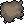

# GRAND SNAIL PRIX
#### _a Lorem Ipsum game_

***

This game was created in 48 hours during the Game Maker's Toolkit's Game Jam 2018 event hosted by _Mark Brown_. The competition's theme was _"GENRE, but you can't MECHANIC"_.

_Grand Snal Prix_ is a local 1v1 racing game **without speed**. Whithout this annoying mechanic, players will have more time to think which strategy should they follow to win the race and avoid obstacles.

### Controls

#### On menus

On Main Menu you can select "Start" or "Exit" by clicking on them.

* **Start**: Will start a new race.
* **Exit**: Will close _Grand Snail Prix_

When the race finishes, you can go back to menu by pressing _Spacebar_

#### In game

| | Player 1 (Blue) | Player 2 (Green)  |
| --------- |:-:| -----------:|
| Move right| D | Arrow right |
| Move up   | W | Arrow right |
| Move down | S | Arrow down  |
| Move left | A | Arrow left  |

### Obstacles

#### Rock - 

Is a rock. You can't go through it.

#### Leaf - 

You will need a few seconds to eat it all, but then your snail will recive a remarkable speed buff.

#### Popcorn - 

Your snail will also eat he is close enough. Although, this will make your snail move even slower.

#### Oil stain - 

Take care, the floor is slippery. If your snail walks into an oil stain, he will slide until he leaves it.

#### Shadow and shoe -  - 

Don't stay under it! Someone is trying to step on you!

### The Lorem Ipsum team

* Marc Castells i Güell
* Adrià Puigdellívol i Pérez

We are a couple of third-year students of Multimedia Engineering in La Salle, Universitat Ramón Llull in Barcelona, Spain.

We are specializing our degree in videogame design, and we found that Game Jams are a great opportunity to test our skills.

We are pretty proud of what we have done. _Grand Snail Prix_ introduce some interesting mechanincs into racing games.

### Licenses

| Asset | Link to asset | License  | Author |
| --------- |:-:| -----------:| -:|
| Main menu music | https://opengameart.org/content/retro | CC0 | Anonymous |
| Race music   | https://opengameart.org/content/victory-victory-victory | CC0 | Spring-Enterprises |
| Winning SFX | https://opengameart.org/content/level-up-sound-effects | CC-BY 3.0  | bart |
| Crowd sounds | https://freesound.org/people/InspectorJ/sounds/398159/ | CC-BY 3.0  | InspectorJ |
